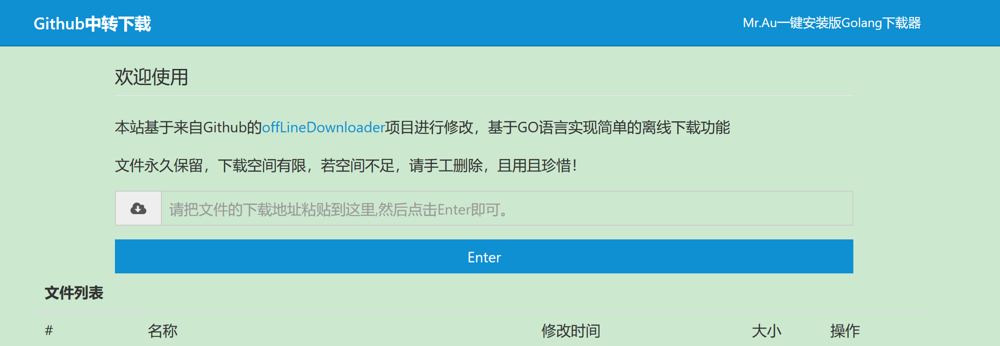
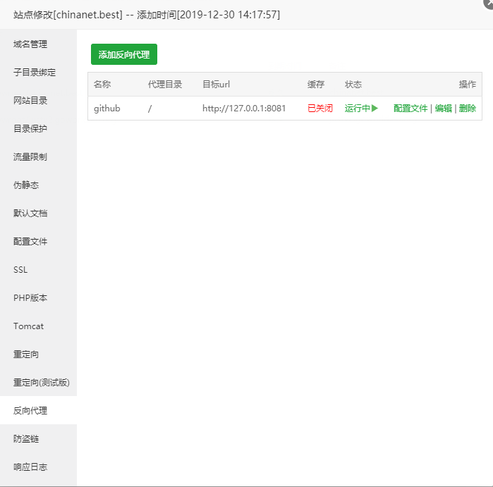

# OneKeyOffLineDownloader
一键部署Github中转下载站的项目。欢迎反馈意见帮助我完善项目。

## 准备环境
- 安装脚本会自动安装GO语言环境，如果已经自己搭建了GO环境的请谨慎使用本脚本。
- 卸载脚本会移除安装脚本生成的所以文件，所以非本安装脚本搭建的请勿使用卸载脚本，因为很暴力。
- 需要提前安装Wget和Git。
## 已知问题
- 没有自启，重启需要后进入目录手动运行。

## 安装
```shell
wget -N --no-check-certificate https://raw.githubusercontent.com/Marukon/OneKeyOffLineDownloader/master/install.sh && chmod +x install.sh && bash install.sh
```
卸载安装版
- 执行
```shell
kill -9 $(ps -ef | grep onekeyod | grep -v grep | awk '{print $2}')
rm -rf OneKeyOffLineDownloader go go1.13.5.linux-amd64.tar.gz download /usr/local/go
```
## 使用
- 访问ip:8081即可。如需不加端口直接访问请修改源码的端口为80后编译一次，或者用Nginx或者宝塔面板图形化界面设置反代。
- 
## 路径相关
- GO安装路径：/usr/local/go
- 下载器安装路径：/root/go
- 下载文件路径： /root/download

## 感谢
ilanyu:https://github.com/ilanyu/offLineDownloader

## License

MIT
